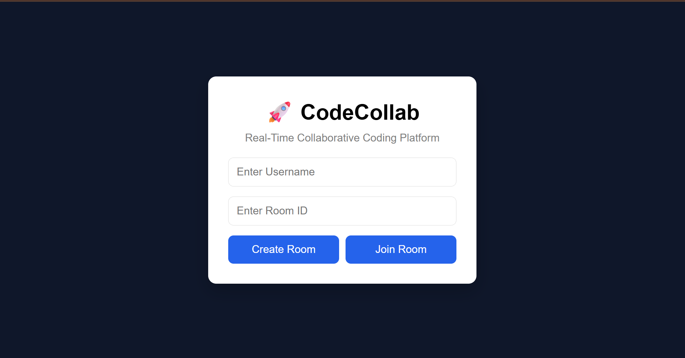
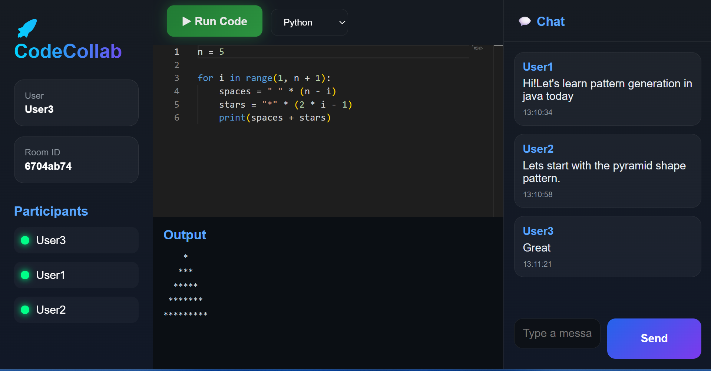

# 🚀 CodeCollab

**CodeCollab** is a real-time collaborative coding platform that enables multiple developers to write, discuss, and execute code together in a shared workspace. Built with modern web technologies and WebSockets, it provides a seamless experience for collaborative problem-solving, interview preparation, pair programming, and team-based coding sessions.

---
## 🌐 Live Demo

🔗 https://code-collab-phi-one.vercel.app

> Note: The frontend is deployed on Vercel. The backend and Docker-based code execution environment are available in the source code and can be run locally.

---
## 🔗 Repository

GitHub: https://github.com/nisatsama/codecollab

---

## 📸 Screenshots

### Join Page



### Editor Page



## ✨ Features

### 🔹 Real-Time Collaborative Code Editor

* Multiple users can join the same coding room and edit code simultaneously.
* Changes are synchronized instantly across all connected clients using **Socket.IO**.
* Supports multiple concurrent participants in a shared room.

### 🔹 Room-Based Collaboration

* Create a unique coding room instantly.
* Share room IDs with teammates using a one-click copy feature.
* Join existing rooms using a valid room ID.

### 🔹 Persistent Session State

* New participants joining an active room can instantly view:

  * Current editor contents
  * Previous chat messages
* Ensures late joiners stay synchronized with ongoing collaboration.

### 🔹 Real-Time Group Chat

* Integrated chat system for communication during coding sessions.
* Messages are delivered instantly using WebSocket connections.
* Enables discussion, debugging, and collaboration without leaving the workspace.

### 🔹 Multi-Language Code Execution

Execute code directly from the browser with containerized execution support.

Supported Languages:

* JavaScript
* Java
* Python
* C++

### 🔹 Secure Containerized Execution

* Code execution is isolated using **Docker containers**.
* Prevents user programs from affecting the host system.
* Provides a safer and more scalable execution environment.

### 🔹 Instant Output Generation

* Compile and run code with a single click.
* Display execution results directly inside the application.

---
## 📊 Project Statistics

- Real-time collaborative editor
- 4 programming languages supported
- Docker-based sandboxed execution
- WebSocket-powered synchronization
- Room-based multi-user collaboration

---

## 🏗️ System Architecture

```text
┌─────────────┐
│ React Frontend │
└──────┬──────┘
       │ HTTP / WebSocket
       ▼
┌─────────────────┐
│ Node.js + Express│
└──────┬──────────┘
       │
       ├── Socket.IO
       │      │
       │      └── Real-Time Collaboration
       │
       └── Docker Containers
              │
              ├── JavaScript Runtime
              ├── Python Runtime
              ├── Java Runtime
              └── C++ Compiler
```

---

## 🛠️ Tech Stack

### Frontend

* React.js
* Axios
* Socket.IO Client

### Backend

* Node.js
* Express.js
* Socket.IO

### Code Execution

* Docker
* Language-specific runtimes and compilers

### Communication

* WebSockets
* Real-Time Event Synchronization

---

## 🚀 Getting Started

### Prerequisites

* Node.js
* Docker Desktop
* npm

### Clone Repository

```bash
git clone https://github.com/yourusername/codecollab.git
cd codecollab
```

### Install Dependencies

#### Frontend

```bash
cd client
npm install
```

#### Backend

```bash
cd server
npm install
```

### Configure Environment Variables

Create a `.env` file inside the server directory.

```env
PORT=5000
```

### Start Backend

```bash
npm start
```

### Start Frontend

```bash
npm run dev
```

### Run Docker

Ensure Docker Desktop is running before executing code.

---

## 🎯 Use Cases

* Technical Interview Preparation
* Pair Programming
* Competitive Programming Practice
* Remote Coding Sessions
* Teaching & Mentoring
* Team Collaboration

---

## 📈 Key Engineering Highlights

* Real-time collaborative editing using WebSockets.
* Stateful room synchronization for new participants.
* Automatic state synchronization for newly joined participants, including chat history and current editor state.
* Multi-language code execution pipeline.
* Docker-based sandboxed execution environment.
* Event-driven architecture using Socket.IO for real-time synchronization.
* Support for multiple concurrent users within a room.

### Code Editor Experience

- Integrated Monaco Editor for a VS Code-like coding experience.
- Syntax highlighting and language switching support.
- Real-time collaborative editing synchronized across participants.
---

## 🔮 Future Enhancements


### 1. Multi-Language Code Execution

* Support for Java, Python, C, C++, Go, Rust, and more.
* Docker-based isolated execution environments for each language.
* Custom compiler/runtime configurations. 


### 2. File Explorer & Multi-File Projects

* Create and manage multiple files within a room.
* Folder structure support.
* More IDE-like experience. 

### 3. Code Persistence & Room History

* Save sessions to a database.
* Restore previous code and chat history.
* Session snapshots and recovery.

### 4. GitHub Integration

* Import repositories.
* Commit and push changes directly from CodeCollab.
* Real-world team collaboration workflows. 


### 5. AI-Powered Coding Assistant

* Code explanations.
* Bug detection.
* Refactoring suggestions.
* Context-aware code completion. 

### 6. Scalability Improvements

* Redis Pub/Sub for distributed Socket.IO communication.
* Horizontal scaling across multiple backend instances.
* Load balancing for large numbers of concurrent rooms.
* Container orchestration with Docker and Kubernetes.


## Keywords

React.js, Node.js, Express.js, Socket.IO, WebSockets,
Docker, Real-Time Collaboration, Monaco Editor,
JavaScript, Java, Python, C++, REST APIs,
System Design, Event-Driven Architecture
## 👨‍💻 Author

**Nisat Sama**

B.Tech Computer Science Engineering

Passionate about building scalable real-time applications, developer tools, and collaborative software systems.

---

### Why CodeCollab?

CodeCollab demonstrates the integration of **real-time systems, distributed communication, containerized code execution, and collaborative software engineering principles** into a production-style application. It combines frontend development, backend architecture, WebSocket communication, and Docker orchestration to deliver a complete developer collaboration platform.

---
Build with ❤️ by Nisat Sama.
